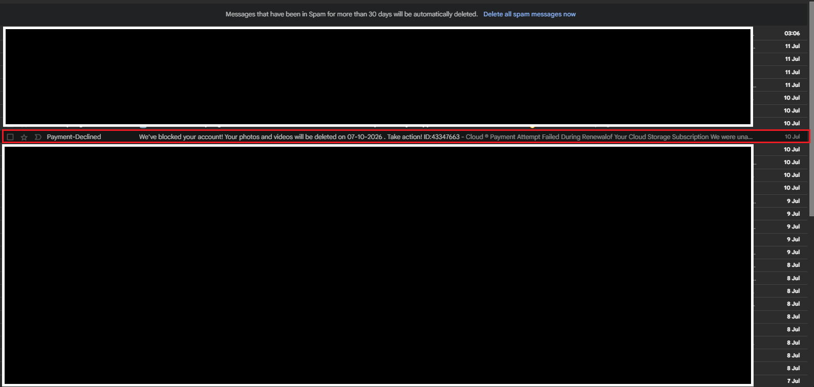
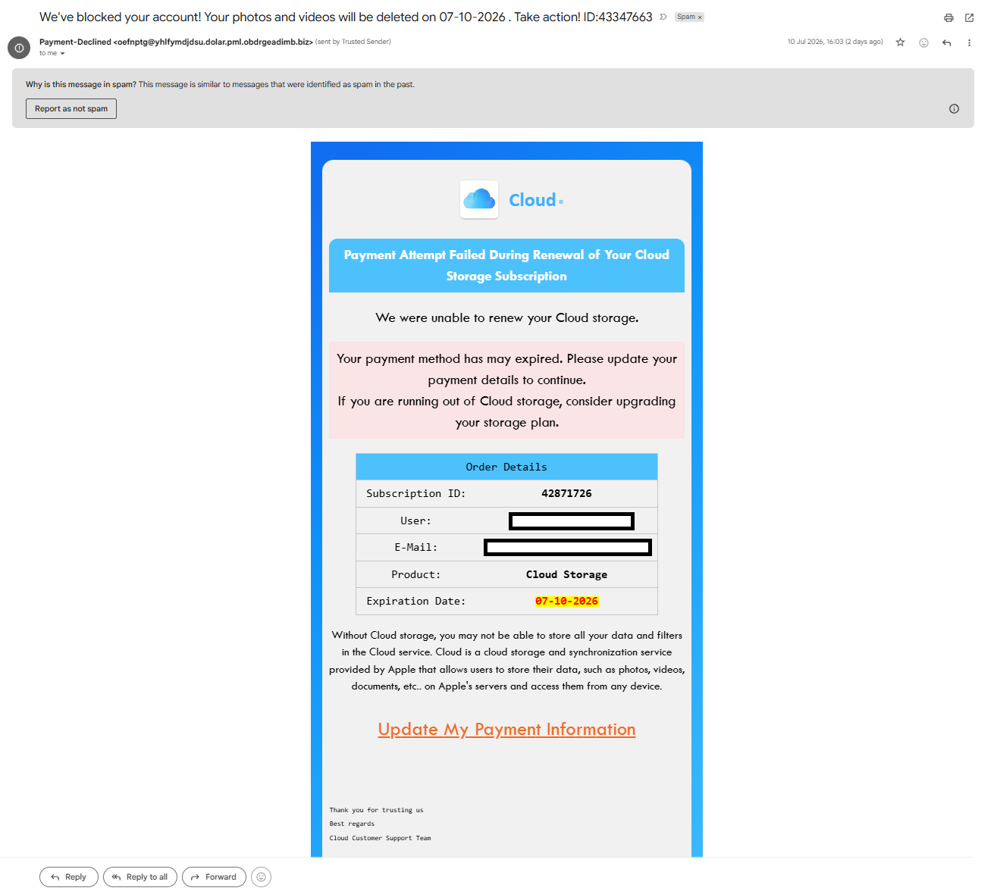
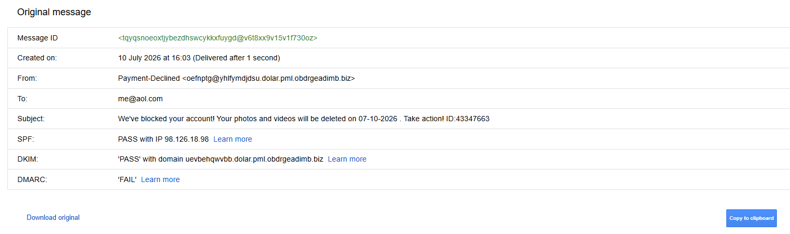
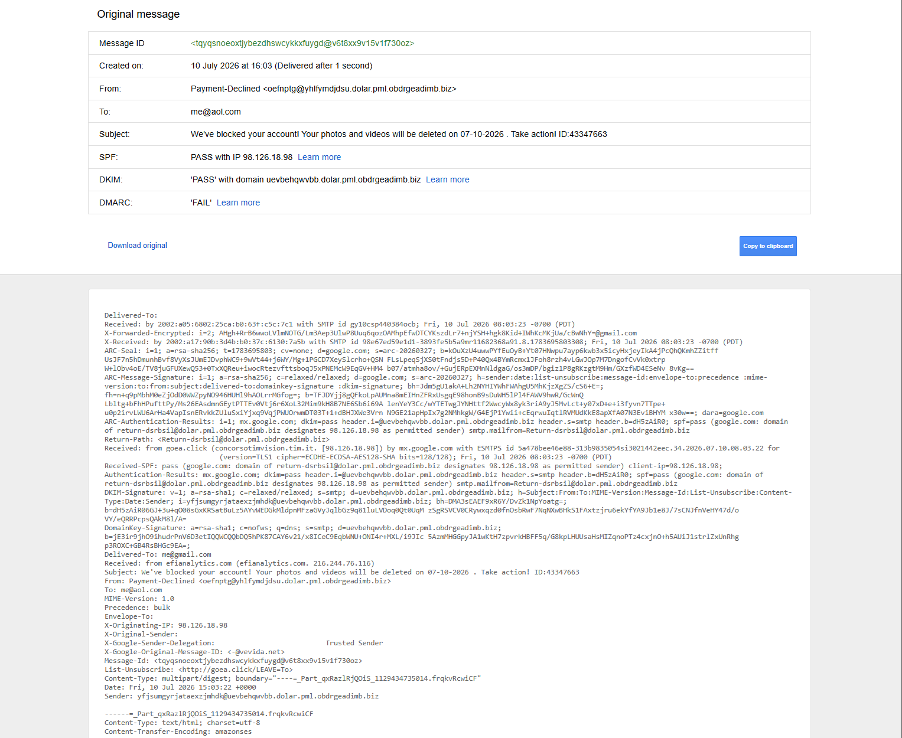
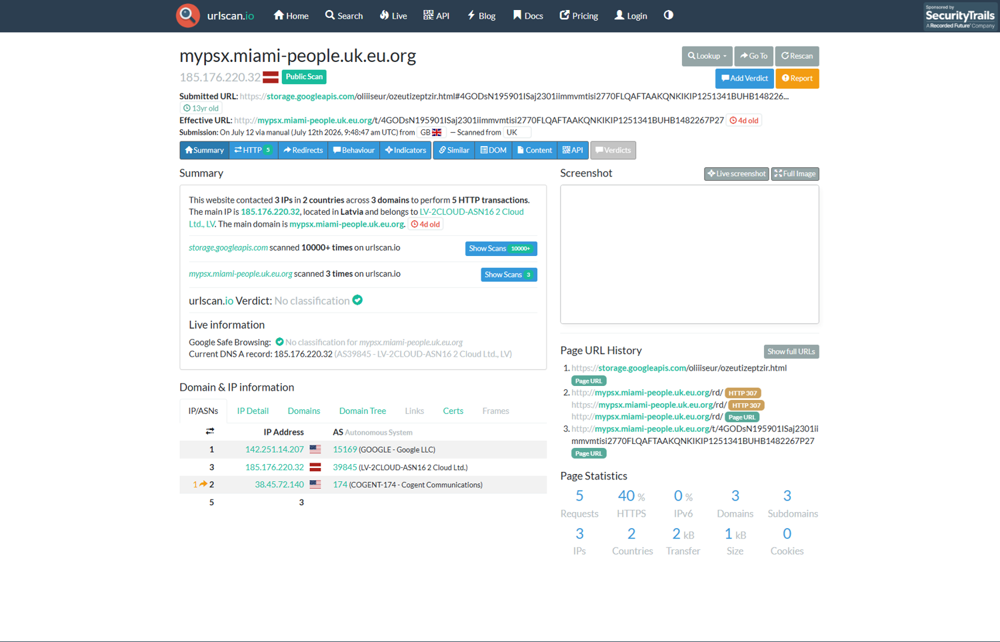
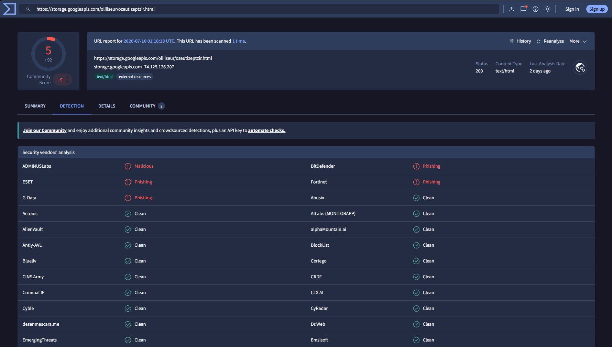
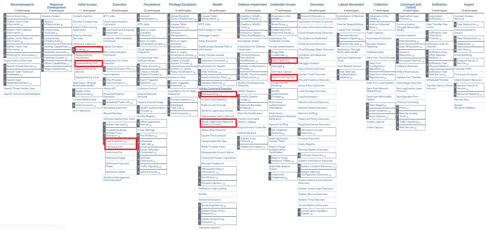

# Phishing Analysis Report: Cloud Storage Renewal Scam

## Summary

I analysed a phishing email impersonating a cloud storage renewal notice. The attacker attempted to create urgency by claiming the user's photos and videos would be deleted unless payment details were updated. The email uses a spoofed sender domain, fake branding, and a link to an externally hosted phishing page designed to harvest payment/credential details.

**Key finding:** the email relies on urgency, brand impersonation, and a fraudulent sender domain to drive users to a remotely hosted phishing page — and was correctly caught by Gmail's own spam filtering before any user interaction occurred.

---

## 1. Environment

| Component | Detail |
|---|---|
| Email Source | Personal Gmail inbox — message was routed to the **Spam** folder by Gmail's native filtering, not delivered to the inbox |
| Platform | Gmail (Web) |
| Network | Standard home LAN, no special routing |
| Tools Used | VirusTotal, urlscan.io, CyberChef, MXToolbox |
| MITRE Techniques | T1566.002, T1204.001, T1056.003, T1036.005 |



**Note on evidence attribution:** this email was captured directly from my own Gmail account and is a real, unsolicited artefact — not a synthetic sample. All analysis in this report is based on the artefact shown above. No live payloads were executed; all URLs were inspected using safe, external analysis tools (VirusTotal, urlscan.io) rather than opened directly in a browser.

**Note on native filtering:** Gmail flagged this message as spam automatically, with the explanation "This message is similar to messages that were identified as spam in the past." This is worth stating plainly rather than treated as incidental — it means the platform's own controls worked as intended in this case, and the manual analysis below is a deeper dive into *why*, not a case where filtering failed and a user was left exposed.

---

## 2. How It Works: Attack Flow

This phishing attempt follows a common credential/payment-harvesting pattern:

1. **Initial lure** — attacker sends a fake subscription renewal notice.
2. **Urgency** — threat of data deletion to force quick action.
3. **Spoofed identity** — randomised sender domain impersonating a generic "Cloud" storage brand.
4. **Malicious link** — user is directed to an externally hosted, fully rendered phishing page.
5. **Credential/payment capture** — the page is designed to collect login or card details.

The attacker relies almost entirely on social engineering and infrastructure obfuscation rather than technical exploitation — there's no malware or exploit involved, just a convincing fake page and a spoofed sender.

---

## 3. Email Breakdown

### 3.1 Sender

```
Payment-Declined <oefnptg@yhlfymdjdsu.dolar.pml.obdrgeadimb.biz>
```

- Randomised local part and subdomain structure
- `.biz` TLD with no relation to any real cloud storage provider
- Multiple chained subdomains (`yhlfymdjdsu.dolar.pml.obdrgeadimb`) — a pattern typical of automated phishing-kit domain generation, designed to look complex enough to discourage casual inspection

### 3.2 Subject

```
We've blocked your account! Your photos and videos will be deleted on 07-10-2026 . Take action! ID:43347663
```

Classic urgency/loss-aversion framing, plus a fabricated reference ID to add a false sense of specificity/legitimacy.

### 3.3 Body



Key elements:
- Fake "Cloud" logo and generic branding (not tied to any real provider's actual visual identity)
- Threat of data deletion by a specific date
- "Update My Payment Information" call-to-action button
- Inconsistent grammar ("Your payment method **has may expired**")
- The footer text explicitly describes "Cloud" as "a cloud storage and synchronization service provided by Apple" — a detail that undermines the email's own branding, since it doesn't match the generic "Cloud" logo used earlier in the message. This inconsistency is a useful, concrete tell to point out to end users during awareness training.

---

## 4. Header Analysis

Headers were extracted via Gmail's "Show original" and inspected for anomalies.





**Findings:**

| Field | Observation |
|---|---|
| SPF | PASS with IP 98.126.18.98 — the sender used an authorised mail server *for its own domain*, which is not proof of legitimacy |
| DKIM | PASS with domain `uevbehqwvbb.dolar.pml.obdrgeadimb.biz` — the DKIM signature matches the attacker's own domain, not any trusted cloud provider |
| DMARC | **FAIL** — the domain's DMARC policy rejects unauthenticated mail; this failure is the strongest authentication signal here and confirms the message did not pass as an authorised sender even for its own claimed identity |
| Source IP | 98.126.18.98 |

Although SPF and DKIM both passed, they validated the attacker's own attacker-registered domain, not a legitimate cloud-storage provider — passing SPF/DKIM only confirms the mail server was authorised to send *for that specific spoofed-looking domain*, which the attacker controls entirely. The DMARC failure is what actually matters here, since it shows the message failed the check meant to prevent this kind of spoofing.

**On the "sent by Trusted Sender" annotation (visible in the inbox view):** the raw headers show this message was originally addressed to an aol.com address and forwarded into the Gmail account being analysed (`X-Google-Sender-Delegation: Trusted Sender`). This label reflects Gmail's mailbox-delegation/forwarding trust relationship — i.e. trust that the forwarding path itself is legitimate — and has nothing to do with the authenticity of the original sender. It's worth being explicit about this, since at a glance "Trusted Sender" next to a phishing email looks like a filtering failure; it isn't one, and the DMARC fail is the actual authenticity verdict.

Combined with the randomised subdomain structure and fear-based subject line, these results identify the email as a spoofed phishing attempt.

---

## 5. URL Inspection

The destination URL was identified by hovering over the "Update My Payment Information" button, which revealed that the entire visible message body was being loaded from a single externally hosted HTML file, rather than the email containing native HTML/links of its own. This let the attacker present a fully rendered phishing page while keeping the actual email content minimal — harder for content-based filters to flag.

### 5.1 URL Extraction

The link pointed to a Google Cloud Storage–hosted HTML file with a randomised directory and filename:
```
https://storage.googleapis.com/oliiiseur/ozeutizeptzir.html
```
This confirms the attacker uploaded a complete phishing page to a legitimate cloud platform and used it as the email's rendered body — a technique commonly seen in commodity phishing kits, since it lets the attacker abuse a trusted, hard-to-block domain (`googleapis.com`) for delivery.

### 5.2 urlscan.io



- The Google Cloud Storage link redirects (HTTP 307) through an intermediate hop to an effective landing domain: `mypsx.miami-people.uk.eu.org`, hosted on IP `185.176.220.32` — an ASN registered in **Latvia** (LV-2CLOUD-ASN16).
- The scan recorded **3 IPs across 2 countries and 3 domains**, over **5 HTTP transactions** — evidence of a short multi-hop redirect chain rather than a single static page.
- The effective phishing domain was only **4 days old** at scan time — a strong indicator of disposable, short-lived phishing infrastructure, and a more concrete data point than "low reputation" alone.
- **urlscan.io's own verdict was "No classification"**, and Google Safe Browsing also returned "No classification" for this domain at scan time. This is worth stating plainly rather than glossed over: automated reputation engines had not yet flagged this specific domain, which is itself a useful finding — it shows how young, fast-rotating phishing infrastructure can outrun blocklist-based detection, and why behavioural indicators (redirect chain, domain age, hosting ASN) matter even when a tool's verdict field is empty.
- Note: this scan was run as a **Public Scan**, meaning the submission itself is visible to anyone browsing urlscan.io, including potentially the attacker. For live/ongoing investigations, submitting scans privately (unlisted) is better practice to avoid tipping off the infrastructure operator.

### 5.3 VirusTotal



VirusTotal's scan of the initial Google Cloud Storage link showed **5 out of 92 vendors** flagging it, with a **community score of −9**:
- **ADMINUSLabs** — Malicious
- **ESET, Fortinet, BitDefender, G-Data** — Phishing

The majority of engines (87/92) returned Clean at scan time, which is consistent with the domain-age finding above — this is early-stage, low-detection phishing infrastructure rather than a widely blocklisted one. It's also worth noting this VT check was run against the initial `storage.googleapis.com` delivery link, not the final `mypsx.miami-people.uk.eu.org` landing domain; a follow-up VT check on the effective redirect destination would give a fuller picture and is noted as a gap here rather than assumed to be covered.

---

## 6. Evidence




---

## 7. Analysis

The combined evidence from the header review (Section 4) and URL inspection (Section 5) shows a phishing attempt built on layered, disposable infrastructure designed to look legitimate to both users and automated controls, while remaining cheap to replace once flagged.

The use of Google Cloud Storage to host the entire phishing page is a deliberate choice: by loading the email's visible content from a trusted, hard-to-block domain, the message itself contains minimal artefacts for filters to key off, while still presenting a fully rendered, convincing renewal notice to the recipient. This lines up with commodity phishing-kit behaviour, which favours randomised, disposable paths precisely to dodge static, signature-based detection — Gmail's own behavioural filtering (Section 1) still caught it, which is a useful reminder that behavioural/reputation-based detection can succeed where purely content-based filtering might not.

The redirect chain observed via urlscan.io (Section 5.2) — from a trusted Google-hosted link to a 4-day-old domain on a Latvian ASN — is the clearest sign of intent to separate "delivery" infrastructure from "collection" infrastructure. This lets an attacker rotate the collection domain freely without needing to change the delivery mechanism, and explains why the destination domain hadn't yet accumulated a reputation-engine verdict at the time of this scan.

VirusTotal's mixed results (5/92 flagged, Section 5.3) reinforce rather than contradict this picture: a low detection count on very young infrastructure is expected, not surprising, and the specific vendors that did flag it (ESET, Fortinet, BitDefender, G-Data, ADMINUSLabs) are enough to corroborate the phishing classification without needing unanimous agreement across all 92 engines.

Taken together — DMARC failure, cross-border redirect chain, sub-week-old domain, and partial but reputable-vendor VirusTotal detections — this is consistent with a structured, repeatable phishing-kit campaign rather than a one-off, manually built attack.

---

## 8. Security Considerations

- The email relied on an externally hosted HTML file (Section 5.1), reducing in-email artefacts and making purely content-based filtering less effective on its own — though Gmail's behavioural filtering still caught it (Section 1).
- The redirect chain moved from a trusted Google-hosted domain to a newly registered, low-reputation domain under a Latvian ASN, which requires behavioural URL analysis rather than a simple domain reputation check to catch reliably (Section 5.2).
- Automated reputation engines (urlscan.io, Google Safe Browsing) had not yet classified the effective landing domain at scan time, despite VirusTotal already showing partial phishing detections — a reminder that different tools can lag each other, and no single tool's "clean" verdict should be treated as conclusive on its own.
- Header authentication results show SPF/DKIM alone are insufficient when an attacker controls their own sending domain outright; DMARC and manual header review (specifically checking what domain SPF/DKIM actually validated against) are what caught this.
- The "Trusted Sender" label shown in Gmail's inbox view reflects mailbox-forwarding delegation, not sender authenticity — worth clarifying in any user-facing write-up so it isn't mistaken for a legitimacy signal.
- This investigation used a **Public Scan** on urlscan.io; for live/ongoing cases, private/unlisted scans avoid alerting the infrastructure operator that their domain is under review.
- The analysed screenshots have been redacted to remove personal email address details ahead of publishing this report to a public repository.

---

## 9. MITRE ATT&CK Mapping

| Technique ID | Name | Description |
|---|---|---|
| T1566.002 | Phishing: Spearphishing Link | Delivery of a malicious email containing a link to an externally hosted phishing page |
| T1204.001 | User Execution: Malicious Link | Reliance on the user clicking the "Update My Payment Information" link |
| T1056.003 | Input Capture: Web Portal Capture | Fake payment/login page designed to capture submitted details |
| T1036.005 | Masquerading: Match Legitimate Name or Location | Fake "Cloud" branding and domain structure designed to imitate a legitimate cloud storage provider |


---

## 10. Recommendations

- **Strengthen email authentication controls** — enforce DMARC with a reject policy and ensure SPF/DKIM alignment to reduce spoofing and unauthorised domain use.
- **Implement behavioural URL analysis** — use tools capable of following multi-stage redirects and inspecting externally hosted HTML content, rather than relying solely on static domain reputation.
- **Mandate multi-factor authentication (MFA)** — ensure cloud-service accounts require MFA so that stolen credentials alone can't be used for account compromise.
- **Enhance user awareness training** — regular phishing simulations and targeted education help users spot mismatched domains, unexpected renewal notices, inconsistent branding (as seen in Section 3.3), and externally hosted content.
- **Integrate threat-intelligence feeds** — monitor and flag newly registered domains, low-reputation ASNs, and disposable-domain patterns similar to those identified here.
- **Deploy outbound traffic monitoring** — detect and block connections to known malicious or newly registered infrastructure, including hosting ASNs like the one observed in this campaign.
- **Review cloud-storage access policies** — restrict or monitor externally hosted HTML content used in inbound email, which is increasingly used to bypass traditional email-security controls.

---

## 11. Conclusion

This investigation confirms that the analysed email was a deliberate phishing attempt designed to harvest payment or credential details under the guise of a cloud-storage renewal notice. Gmail's own filtering correctly routed the message to Spam before any user interaction, and the deeper analysis in this report confirms why: a DMARC failure, a spoofed sender domain, and a multi-hop redirect chain leading to a newly registered domain on a low-reputation ASN.

The campaign's use of a trusted cloud platform (Google Cloud Storage) for delivery, paired with disposable, days-old infrastructure for collection, is consistent with commodity phishing-kit behaviour rather than a one-off manual attack. Partial but reputable-vendor detections on VirusTotal, combined with the domain-age and redirect evidence from urlscan.io, support this conclusion even though no single tool returned a definitive "malicious" verdict on its own.

Strengthening DMARC enforcement, mandating MFA, and pairing behavioural URL analysis with threat-intelligence feeds on newly registered domains are the most direct ways to reduce exposure to similar campaigns going forward.
